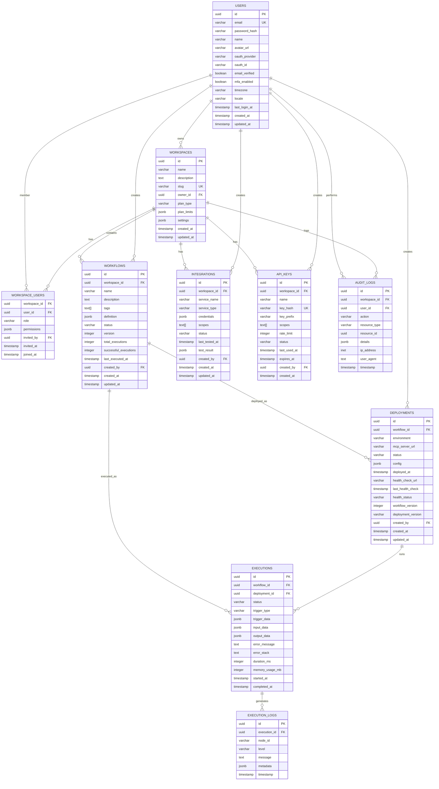

# MCP 서버 생성 플랫폼 - 데이터베이스 설계

## 📋 개요

본 문서는 MCP 서버 생성 플랫폼의 PostgreSQL 데이터베이스 설계를 정의합니다.

### 설계 원칙
- **정규화**: 3NF 준수로 데이터 중복 최소화
- **성능**: 적절한 인덱싱과 파티셔닝
- **확장성**: 수평/수직 확장 고려
- **보안**: 데이터 암호화와 접근 제어
- **무결성**: 외래키와 제약조건으로 데이터 일관성 보장

## 🏗️ 전체 ERD

```

```

## 📊 핵심 테이블 설계

### 1. Users 테이블
사용자 정보를 저장하는 핵심 테이블

```sql
CREATE TABLE users (
    id UUID PRIMARY KEY DEFAULT gen_random_uuid(),
    email VARCHAR(255) UNIQUE NOT NULL,
    password_hash VARCHAR(255),
    name VARCHAR(255) NOT NULL,
    avatar_url VARCHAR(500),
    oauth_provider VARCHAR(50),
    oauth_id VARCHAR(255),
    email_verified BOOLEAN DEFAULT FALSE,
    mfa_enabled BOOLEAN DEFAULT FALSE,
    timezone VARCHAR(50) DEFAULT 'UTC',
    locale VARCHAR(10) DEFAULT 'en',
    last_login_at TIMESTAMP,
    created_at TIMESTAMP DEFAULT NOW(),
    updated_at TIMESTAMP DEFAULT NOW()
);
```

### 2. Workspaces 테이블
워크스페이스(팀/조직) 정보

```sql
CREATE TABLE workspaces (
    id UUID PRIMARY KEY DEFAULT gen_random_uuid(),
    name VARCHAR(255) NOT NULL,
    description TEXT,
    slug VARCHAR(100) UNIQUE,
    owner_id UUID NOT NULL REFERENCES users(id),
    plan_type VARCHAR(50) NOT NULL DEFAULT 'free',
    plan_limits JSONB NOT NULL DEFAULT '{}',
    settings JSONB NOT NULL DEFAULT '{}',
    created_at TIMESTAMP DEFAULT NOW(),
    updated_at TIMESTAMP DEFAULT NOW()
);
```

### 3. Workflows 테이블
워크플로우 정의 저장

```sql
CREATE TABLE workflows (
    id UUID PRIMARY KEY DEFAULT gen_random_uuid(),
    workspace_id UUID NOT NULL REFERENCES workspaces(id),
    name VARCHAR(255) NOT NULL,
    description TEXT,
    tags TEXT[] DEFAULT '{}',
    definition JSONB NOT NULL,
    status VARCHAR(50) NOT NULL DEFAULT 'draft',
    version INTEGER NOT NULL DEFAULT 1,
    total_executions INTEGER DEFAULT 0,
    successful_executions INTEGER DEFAULT 0,
    last_executed_at TIMESTAMP,
    created_by UUID NOT NULL REFERENCES users(id),
    created_at TIMESTAMP DEFAULT NOW(),
    updated_at TIMESTAMP DEFAULT NOW()
);
```

## 📊 테이블 상세 설계

### 1. Workspace_Users 테이블
워크스페이스 멤버십 관리

```sql
CREATE TABLE workspace_users (
    workspace_id UUID NOT NULL REFERENCES workspaces(id) ON DELETE CASCADE,
    user_id UUID NOT NULL REFERENCES users(id) ON DELETE CASCADE,
    role VARCHAR(50) NOT NULL DEFAULT 'viewer',
    permissions JSONB NOT NULL DEFAULT '[]', -- 추가 권한
    
    -- 메타데이터
    invited_by UUID REFERENCES users(id),
    invited_at TIMESTAMP,
    joined_at TIMESTAMP DEFAULT NOW(),
    
    PRIMARY KEY (workspace_id, user_id),
    
    -- 제약조건
    CONSTRAINT workspace_users_role_check CHECK (role IN ('owner', 'admin', 'editor', 'viewer'))
);

-- 인덱스
CREATE INDEX idx_workspace_users_user_id ON workspace_users(user_id);
CREATE INDEX idx_workspace_users_role ON workspace_users(role);
```

### 4. Workflow_Versions 테이블
워크플로우 버전 관리

```sql
CREATE TABLE workflow_versions (
    id UUID PRIMARY KEY DEFAULT gen_random_uuid(),
    workflow_id UUID NOT NULL REFERENCES workflows(id) ON DELETE CASCADE,
    version INTEGER NOT NULL,
    definition JSONB NOT NULL,
    changelog TEXT,
    
    -- 메타데이터
    created_by UUID NOT NULL REFERENCES users(id),
    created_at TIMESTAMP DEFAULT NOW(),
    
    UNIQUE(workflow_id, version)
);

-- 인덱스
CREATE INDEX idx_workflow_versions_workflow_id ON workflow_versions(workflow_id);
CREATE INDEX idx_workflow_versions_version ON workflow_versions(workflow_id, version DESC);
```

### 5. Integrations 테이블
외부 서비스 연동 정보

```sql
CREATE TABLE integrations (
    id UUID PRIMARY KEY DEFAULT gen_random_uuid(),
    workspace_id UUID NOT NULL REFERENCES workspaces(id) ON DELETE CASCADE,
    
    -- 서비스 정보
    service_name VARCHAR(100) NOT NULL, -- 'google', 'slack', etc.
    service_type VARCHAR(50) NOT NULL,  -- 'oauth2', 'api_key', etc.
    
    -- 인증 정보 (암호화됨)
    credentials JSONB NOT NULL,
    scopes TEXT[] DEFAULT '{}',
    
    -- 상태
    status VARCHAR(50) NOT NULL DEFAULT 'active',
    last_tested_at TIMESTAMP,
    test_result JSONB,
    
    -- 메타데이터
    created_by UUID NOT NULL REFERENCES users(id),
    created_at TIMESTAMP DEFAULT NOW(),
    updated_at TIMESTAMP DEFAULT NOW(),
    
    -- 제약조건
    CONSTRAINT integrations_status_check CHECK (status IN ('active', 'inactive', 'error')),
    
    UNIQUE(workspace_id, service_name)
);

-- 인덱스
CREATE INDEX idx_integrations_workspace_id ON integrations(workspace_id);
CREATE INDEX idx_integrations_service_name ON integrations(service_name);
CREATE INDEX idx_integrations_status ON integrations(status);
```

### 6. Deployments 테이블
MCP 서버 배포 정보

```sql
CREATE TABLE deployments (
    id UUID PRIMARY KEY DEFAULT gen_random_uuid(),
    workflow_id UUID NOT NULL REFERENCES workflows(id) ON DELETE CASCADE,
    
    -- 배포 정보
    environment VARCHAR(50) NOT NULL DEFAULT 'production',
    mcp_server_url VARCHAR(500) NOT NULL,
    status VARCHAR(50) NOT NULL DEFAULT 'deploying',
    
    -- 설정
    config JSONB NOT NULL DEFAULT '{}',
    
    -- 배포 메타데이터
    deployed_at TIMESTAMP,
    health_check_url VARCHAR(500),
    last_health_check TIMESTAMP,
    health_status VARCHAR(50),
    
    -- 버전 정보
    workflow_version INTEGER NOT NULL,
    deployment_version VARCHAR(50),
    
    -- 메타데이터
    created_by UUID NOT NULL REFERENCES users(id),
    created_at TIMESTAMP DEFAULT NOW(),
    updated_at TIMESTAMP DEFAULT NOW(),
    
    -- 제약조건
    CONSTRAINT deployments_status_check CHECK (
        status IN ('deploying', 'deployed', 'failed', 'stopped')
    ),
    CONSTRAINT deployments_environment_check CHECK (
        environment IN ('development', 'staging', 'production')
    )
);

-- 인덱스
CREATE INDEX idx_deployments_workflow_id ON deployments(workflow_id);
CREATE INDEX idx_deployments_status ON deployments(status);
CREATE INDEX idx_deployments_environment ON deployments(environment);
CREATE INDEX idx_deployments_created_at ON deployments(created_at);
```

### 7. Executions 테이블
워크플로우 실행 이력

```sql
CREATE TABLE executions (
    id UUID PRIMARY KEY DEFAULT gen_random_uuid(),
    workflow_id UUID NOT NULL REFERENCES workflows(id) ON DELETE CASCADE,
    deployment_id UUID REFERENCES deployments(id),
    
    -- 실행 정보
    status VARCHAR(50) NOT NULL DEFAULT 'running',
    trigger_type VARCHAR(100) NOT NULL, -- 'webhook', 'schedule', 'manual', etc.
    trigger_data JSONB,
    
    -- 데이터
    input_data JSONB,
    output_data JSONB,
    error_message TEXT,
    error_stack TEXT,
    
    -- 성능 메트릭
    duration_ms INTEGER,
    memory_usage_mb INTEGER,
    
    -- 타임스탬프
    started_at TIMESTAMP DEFAULT NOW(),
    completed_at TIMESTAMP,
    
    -- 제약조건
    CONSTRAINT executions_status_check CHECK (
        status IN ('running', 'success', 'failed', 'cancelled', 'timeout')
    ),
    CONSTRAINT executions_duration_check CHECK (
        (completed_at IS NULL) OR (completed_at >= started_at)
    )
);

-- 파티셔닝 (월별)
CREATE TABLE executions_y2024m01 PARTITION OF executions
FOR VALUES FROM ('2024-01-01') TO ('2024-02-01');

CREATE TABLE executions_y2024m02 PARTITION OF executions
FOR VALUES FROM ('2024-02-01') TO ('2024-03-01');

-- 인덱스
CREATE INDEX idx_executions_workflow_id ON executions(workflow_id);
CREATE INDEX idx_executions_status ON executions(status);
CREATE INDEX idx_executions_started_at ON executions(started_at);
CREATE INDEX idx_executions_trigger_type ON executions(trigger_type);
```

### 8. Execution_Logs 테이블
실행 로그 상세 정보

```sql
CREATE TABLE execution_logs (
    id UUID PRIMARY KEY DEFAULT gen_random_uuid(),
    execution_id UUID NOT NULL REFERENCES executions(id) ON DELETE CASCADE,
    
    -- 로그 정보
    node_id VARCHAR(255), -- 워크플로우 노드 ID
    level VARCHAR(20) NOT NULL DEFAULT 'info',
    message TEXT NOT NULL,
    metadata JSONB,
    
    -- 타임스탬프
    timestamp TIMESTAMP DEFAULT NOW(),
    
    -- 제약조건
    CONSTRAINT execution_logs_level_check CHECK (
        level IN ('debug', 'info', 'warn', 'error')
    )
);

-- 파티셔닝 (월별)
CREATE TABLE execution_logs_y2024m01 PARTITION OF execution_logs
FOR VALUES FROM ('2024-01-01') TO ('2024-02-01');

-- 인덱스
CREATE INDEX idx_execution_logs_execution_id ON execution_logs(execution_id);
CREATE INDEX idx_execution_logs_level ON execution_logs(level);
CREATE INDEX idx_execution_logs_timestamp ON execution_logs(timestamp);
```

### 9. API_Keys 테이블
API 키 관리

```sql
CREATE TABLE api_keys (
    id UUID PRIMARY KEY DEFAULT gen_random_uuid(),
    workspace_id UUID NOT NULL REFERENCES workspaces(id) ON DELETE CASCADE,
    
    -- 키 정보
    name VARCHAR(255) NOT NULL,
    key_hash VARCHAR(255) NOT NULL UNIQUE, -- SHA-256 해시
    key_prefix VARCHAR(20) NOT NULL, -- 표시용 (예: "mcp_1234...")
    
    -- 권한 및 제한
    scopes TEXT[] NOT NULL DEFAULT '{}',
    rate_limit INTEGER DEFAULT 1000, -- requests per hour
    
    -- 상태
    status VARCHAR(50) NOT NULL DEFAULT 'active',
    last_used_at TIMESTAMP,
    expires_at TIMESTAMP,
    
    -- 메타데이터
    created_by UUID NOT NULL REFERENCES users(id),
    created_at TIMESTAMP DEFAULT NOW(),
    
    -- 제약조건
    CONSTRAINT api_keys_status_check CHECK (status IN ('active', 'inactive', 'revoked'))
);

-- 인덱스
CREATE INDEX idx_api_keys_workspace_id ON api_keys(workspace_id);
CREATE INDEX idx_api_keys_key_hash ON api_keys(key_hash);
CREATE INDEX idx_api_keys_status ON api_keys(status);
```

### 10. Audit_Logs 테이블
감사 로그

```sql
CREATE TABLE audit_logs (
    id UUID PRIMARY KEY DEFAULT gen_random_uuid(),
    
    -- 컨텍스트
    workspace_id UUID REFERENCES workspaces(id),
    user_id UUID REFERENCES users(id),
    
    -- 액션 정보
    action VARCHAR(100) NOT NULL,
    resource_type VARCHAR(100) NOT NULL,
    resource_id UUID,
    
    -- 상세 정보
    details JSONB,
    ip_address INET,
    user_agent TEXT,
    
    -- 타임스탬프
    timestamp TIMESTAMP DEFAULT NOW()
);

-- 파티셔닝 (월별)
CREATE TABLE audit_logs_y2024m01 PARTITION OF audit_logs
FOR VALUES FROM ('2024-01-01') TO ('2024-02-01');

-- 인덱스
CREATE INDEX idx_audit_logs_workspace_id ON audit_logs(workspace_id);
CREATE INDEX idx_audit_logs_user_id ON audit_logs(user_id);
CREATE INDEX idx_audit_logs_action ON audit_logs(action);
CREATE INDEX idx_audit_logs_timestamp ON audit_logs(timestamp);
```

## 🔍 뷰(Views) 정의

### 1. Workflow Statistics View
워크플로우 통계 정보를 집계하는 뷰

```sql
CREATE VIEW workflow_statistics AS
SELECT 
    w.id,
    w.name,
    w.workspace_id,
    COUNT(e.id) as total_executions,
    COUNT(CASE WHEN e.status = 'success' THEN 1 END) as successful_executions,
    COUNT(CASE WHEN e.status = 'failed' THEN 1 END) as failed_executions,
    ROUND(
        COUNT(CASE WHEN e.status = 'success' THEN 1 END) * 100.0 / NULLIF(COUNT(e.id), 0), 
        2
    ) as success_rate,
    AVG(e.duration_ms) as avg_duration_ms,
    MAX(e.started_at) as last_executed_at
FROM workflows w
LEFT JOIN executions e ON w.id = e.workflow_id
GROUP BY w.id, w.name, w.workspace_id;
```

### 2. User Dashboard View
사용자 대시보드용 집계 뷰

```sql
CREATE VIEW user_dashboard AS
SELECT 
    u.id as user_id,
    COUNT(DISTINCT w.id) as total_workflows,
    COUNT(DISTINCT CASE WHEN w.status = 'active' THEN w.id END) as active_workflows,
    COUNT(DISTINCT e.id) as total_executions,
    COUNT(DISTINCT ws.id) as total_workspaces
FROM users u
LEFT JOIN workspace_users wu ON u.id = wu.user_id
LEFT JOIN workspaces ws ON wu.workspace_id = ws.id
LEFT JOIN workflows w ON ws.id = w.workspace_id
LEFT JOIN executions e ON w.id = e.workflow_id
GROUP BY u.id;
```

## 🔐 보안 및 권한

### 1. Row Level Security (RLS)
워크스페이스 기반 데이터 접근 제어

```sql
-- Workspaces 테이블 RLS
ALTER TABLE workspaces ENABLE ROW LEVEL SECURITY;

CREATE POLICY workspace_access_policy ON workspaces
    FOR ALL TO application_user
    USING (
        id IN (
            SELECT workspace_id 
            FROM workspace_users 
            WHERE user_id = current_setting('app.current_user_id')::uuid
        )
    );

-- Workflows 테이블 RLS
ALTER TABLE workflows ENABLE ROW LEVEL SECURITY;

CREATE POLICY workflow_access_policy ON workflows
    FOR ALL TO application_user
    USING (
        workspace_id IN (
            SELECT workspace_id 
            FROM workspace_users 
            WHERE user_id = current_setting('app.current_user_id')::uuid
        )
    );
```

### 2. 암호화 함수
민감한 데이터 암호화

```sql
-- 암호화 확장 활성화
CREATE EXTENSION IF NOT EXISTS pgcrypto;

-- 크리덴셜 암호화 함수
CREATE OR REPLACE FUNCTION encrypt_credentials(data JSONB, key TEXT)
RETURNS TEXT AS $$
BEGIN
    RETURN encode(
        pgp_sym_encrypt(data::text, key), 
        'base64'
    );
END;
$$ LANGUAGE plpgsql;

-- 크리덴셜 복호화 함수
CREATE OR REPLACE FUNCTION decrypt_credentials(encrypted_data TEXT, key TEXT)
RETURNS JSONB AS $$
BEGIN
    RETURN pgp_sym_decrypt(
        decode(encrypted_data, 'base64'), 
        key
    )::JSONB;
END;
$$ LANGUAGE plpgsql;
```

## 📈 성능 최적화

### 1. 파티셔닝 전략
대용량 테이블의 월별 파티셔닝

```sql
-- 자동 파티션 생성 함수
CREATE OR REPLACE FUNCTION create_monthly_partition(
    table_name TEXT,
    start_date DATE
) RETURNS VOID AS $$
DECLARE
    partition_name TEXT;
    end_date DATE;
BEGIN
    partition_name := table_name || '_y' || 
                     EXTRACT(YEAR FROM start_date) || 'm' || 
                     LPAD(EXTRACT(MONTH FROM start_date)::TEXT, 2, '0');
    end_date := start_date + INTERVAL '1 month';
    
    EXECUTE format(
        'CREATE TABLE %I PARTITION OF %I FOR VALUES FROM (%L) TO (%L)',
        partition_name, table_name, start_date, end_date
    );
END;
$$ LANGUAGE plpgsql;
```

### 2. 인덱스 최적화
복합 인덱스와 부분 인덱스

```sql
-- 워크플로우 검색용 복합 인덱스
CREATE INDEX idx_workflows_workspace_status_updated 
ON workflows(workspace_id, status, updated_at DESC);

-- 활성 실행만 대상으로 하는 부분 인덱스
CREATE INDEX idx_executions_running 
ON executions(workflow_id, started_at) 
WHERE status = 'running';

-- JSON 필드 인덱스
CREATE INDEX idx_workflows_definition_nodes 
ON workflows USING GIN((definition->'nodes'));
```

### 3. 통계 업데이트 트리거
실시간 통계 업데이트

```sql
-- 워크플로우 실행 통계 업데이트 함수
CREATE OR REPLACE FUNCTION update_workflow_stats()
RETURNS TRIGGER AS $$
BEGIN
    IF TG_OP = 'INSERT' AND NEW.status IN ('success', 'failed') THEN
        UPDATE workflows SET
            total_executions = total_executions + 1,
            successful_executions = CASE 
                WHEN NEW.status = 'success' 
                THEN successful_executions + 1 
                ELSE successful_executions 
            END,
            last_executed_at = NEW.completed_at
        WHERE id = NEW.workflow_id;
    END IF;
    
    RETURN COALESCE(NEW, OLD);
END;
$$ LANGUAGE plpgsql;

-- 트리거 생성
CREATE TRIGGER trigger_update_workflow_stats
    AFTER INSERT OR UPDATE ON executions
    FOR EACH ROW
    EXECUTE FUNCTION update_workflow_stats();
```

## 🔧 데이터베이스 설정

### 1. PostgreSQL 설정
성능 최적화를 위한 설정

```sql
-- 성능 관련 설정
ALTER SYSTEM SET shared_buffers = '256MB';
ALTER SYSTEM SET effective_cache_size = '1GB';
ALTER SYSTEM SET maintenance_work_mem = '64MB';
ALTER SYSTEM SET checkpoint_completion_target = 0.9;
ALTER SYSTEM SET wal_buffers = '16MB';
ALTER SYSTEM SET default_statistics_target = 100;

-- 연결 설정
ALTER SYSTEM SET max_connections = 200;
ALTER SYSTEM SET shared_preload_libraries = 'pg_stat_statements';

SELECT pg_reload_conf();
```

### 2. 백업 및 복구 전략

```sql
-- 연속 아카이빙 설정
ALTER SYSTEM SET archive_mode = 'on';
ALTER SYSTEM SET archive_command = 'cp %p /var/lib/postgresql/archive/%f';
ALTER SYSTEM SET wal_level = 'replica';

-- PITR (Point-in-Time Recovery) 설정
ALTER SYSTEM SET max_wal_senders = 3;
ALTER SYSTEM SET wal_keep_segments = 32;
```

이 데이터베이스 설계는 확장성, 성능, 보안을 모두 고려하여 설계되었으며, MCP 서버 생성 플랫폼의 모든 기능을 지원할 수 있도록 구성되었습니다. 