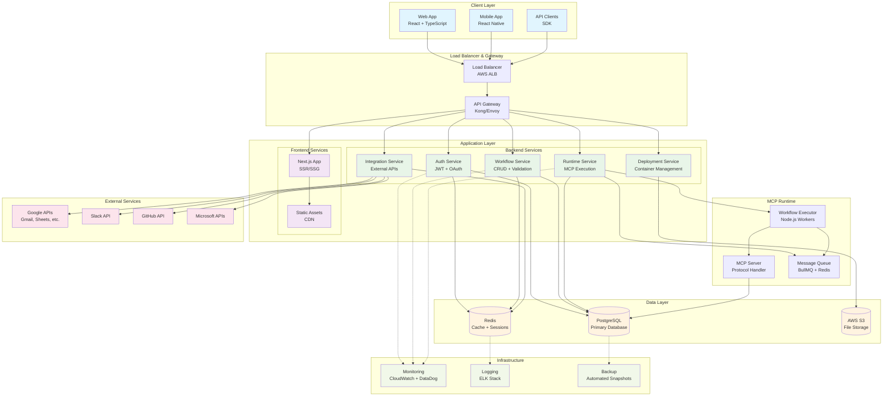

# MCP 서버 생성 플랫폼 - 시스템 설계 문서

## 📋 개요

본 문서는 요구사항 분석을 바탕으로 MCP(Model Context Protocol) 서버 생성 플랫폼의 전체 시스템 설계를 정의합니다.

### 🎯 설계 목표
- **사용자 친화성**: 15분 내 첫 MCP 서버 배포
- **확장성**: 50,000 동시 사용자 지원
- **보안성**: Zero Trust 아키텍처 구현
- **성능**: 페이지 로드 2초, API 응답 200ms 이내

## 🏗️ 전체 아키텍처

### High-Level Architecture



## 🎨 Frontend 아키텍처

### Component Architecture
```typescript
src/
├── app/                    # App-level configuration
│   ├── store/             # Global state management (Zustand)
│   ├── router/            # React Router setup
│   └── providers/         # Context providers
├── features/              # Feature-based modules
│   ├── auth/              # Authentication
│   ├── workflow/          # Workflow builder
│   ├── deployment/        # MCP server deployment
│   └── monitoring/        # Runtime monitoring
├── shared/                # Shared utilities
│   ├── components/        # Reusable UI components
│   ├── hooks/             # Custom React hooks
│   ├── utils/             # Helper functions
│   └── types/             # TypeScript definitions
└── assets/                # Static assets
```

### State Management Strategy
```typescript
// Zustand stores for different domains
interface AppState {
  auth: AuthState;
  workflow: WorkflowState;
  deployment: DeploymentState;
  ui: UIState;
}

// Feature-specific stores
interface WorkflowState {
  currentWorkflow: Workflow | null;
  nodes: Node[];
  connections: Connection[];
  isExecuting: boolean;
  executionLogs: ExecutionLog[];
}
```

### UI Component System
- **Design System**: Shadcn/ui + Radix UI primitives
- **Styling**: Tailwind CSS with custom design tokens
- **Icons**: Lucide React
- **Animations**: Framer Motion
- **Canvas**: React Flow for workflow editor

## 🔧 Backend 아키텍처

### Microservices Architecture
```
┌─────────────────┐  ┌─────────────────┐  ┌─────────────────┐  ┌─────────────────┐
│   Auth Service  │  │Workflow Service │  │Runtime Service  │  │Integration Svc  │
│   (User/Auth)   │  │ (CRUD/Validate) │  │ (Execute/Deploy)│  │ (External APIs) │
└─────────────────┘  └─────────────────┘  └─────────────────┘  └─────────────────┘
         │                     │                     │                     │
         └─────────────────────┼─────────────────────┼─────────────────────┘
                               │                     │
                               ▼                     ▼
                    ┌─────────────────┐    ┌─────────────────┐
                    │  Message Queue  │    │   File Storage  │
                    │ (Redis/BullMQ)  │    │    (AWS S3)     │
                    └─────────────────┘    └─────────────────┘
```

### API Layer Design
```typescript
// RESTful API structure
/api/v1/
├── /auth              # Authentication endpoints
├── /users             # User management
├── /workspaces        # Workspace management
├── /workflows         # Workflow CRUD
├── /nodes             # Node definitions
├── /integrations      # External service integrations
├── /deployments       # MCP server deployments
├── /executions        # Workflow executions
└── /monitoring        # Runtime monitoring
```

### Database Schema Design
```sql
-- Core entities
CREATE TABLE users (
    id UUID PRIMARY KEY,
    email VARCHAR(255) UNIQUE NOT NULL,
    password_hash VARCHAR(255),
    oauth_provider VARCHAR(50),
    oauth_id VARCHAR(255),
    created_at TIMESTAMP DEFAULT NOW(),
    updated_at TIMESTAMP DEFAULT NOW()
);

CREATE TABLE workspaces (
    id UUID PRIMARY KEY,
    name VARCHAR(255) NOT NULL,
    owner_id UUID REFERENCES users(id),
    plan_type VARCHAR(50) DEFAULT 'free',
    created_at TIMESTAMP DEFAULT NOW()
);

CREATE TABLE workflows (
    id UUID PRIMARY KEY,
    workspace_id UUID REFERENCES workspaces(id),
    name VARCHAR(255) NOT NULL,
    description TEXT,
    definition JSONB NOT NULL,
    status VARCHAR(50) DEFAULT 'draft',
    created_at TIMESTAMP DEFAULT NOW(),
    updated_at TIMESTAMP DEFAULT NOW()
);

CREATE TABLE deployments (
    id UUID PRIMARY KEY,
    workflow_id UUID REFERENCES workflows(id),
    mcp_server_url VARCHAR(500) NOT NULL,
    status VARCHAR(50) DEFAULT 'deploying',
    deployed_at TIMESTAMP,
    created_at TIMESTAMP DEFAULT NOW()
);

CREATE TABLE executions (
    id UUID PRIMARY KEY,
    workflow_id UUID REFERENCES workflows(id),
    status VARCHAR(50) DEFAULT 'running',
    input_data JSONB,
    output_data JSONB,
    error_message TEXT,
    started_at TIMESTAMP DEFAULT NOW(),
    completed_at TIMESTAMP
);
```

## 🔐 보안 아키텍처

### Authentication & Authorization
```typescript
// JWT-based authentication
interface AuthToken {
  sub: string;           // User ID
  email: string;         // User email
  workspaces: string[];  // Accessible workspace IDs
  permissions: string[]; // User permissions
  iat: number;          // Issued at
  exp: number;          // Expires at
}

// Role-based access control
enum Role {
  OWNER = 'owner',
  ADMIN = 'admin',
  EDITOR = 'editor',
  VIEWER = 'viewer'
}

enum Permission {
  WORKFLOW_CREATE = 'workflow:create',
  WORKFLOW_READ = 'workflow:read',
  WORKFLOW_UPDATE = 'workflow:update',
  WORKFLOW_DELETE = 'workflow:delete',
  WORKFLOW_EXECUTE = 'workflow:execute',
  DEPLOYMENT_MANAGE = 'deployment:manage'
}
```

### Data Encryption
```typescript
// Encryption strategy
interface EncryptionConfig {
  algorithm: 'AES-256-GCM';
  keyRotationPeriod: '90 days';
  credentialEncryption: 'per-user-key';
  databaseEncryption: 'transparent-data-encryption';
  transitEncryption: 'TLS 1.3';
}
```

## 🚀 MCP 서버 런타임

### MCP Protocol Implementation
```typescript
// MCP Server interface
interface MCPServer {
  // Protocol compliance
  version: '1.0+';
  transport: 'sse' | 'http';
  
  // Core methods
  initialize(): Promise<InitializeResult>;
  listTools(): Promise<Tool[]>;
  callTool(request: ToolCallRequest): Promise<ToolCallResult>;
  
  // Lifecycle management
  start(): Promise<void>;
  stop(): Promise<void>;
  health(): Promise<HealthStatus>;
}

// Tool definition
interface Tool {
  name: string;
  description: string;
  inputSchema: JSONSchema;
  handler: ToolHandler;
}
```

### Workflow Execution Engine
```typescript
// Node execution interface
interface NodeExecutor {
  execute(input: any, context: ExecutionContext): Promise<NodeResult>;
}

// Execution context
interface ExecutionContext {
  workflowId: string;
  executionId: string;
  userId: string;
  credentials: Record<string, any>;
  variables: Record<string, any>;
  logger: Logger;
}

// Execution flow
class WorkflowEngine {
  async execute(workflow: Workflow, input: any): Promise<ExecutionResult> {
    const context = this.createContext(workflow, input);
    const executor = new DAGExecutor(workflow.nodes, workflow.connections);
    return await executor.run(context);
  }
}
```

## 🔗 외부 서비스 통합

### Integration Architecture
```typescript
// Service connector interface
interface ServiceConnector {
  name: string;
  authType: 'oauth2' | 'api-key' | 'basic';
  authenticate(credentials: any): Promise<AuthResult>;
  call(endpoint: string, params: any): Promise<any>;
  validateCredentials(credentials: any): Promise<boolean>;
}

// OAuth 2.0 flow
class OAuth2Connector implements ServiceConnector {
  async authenticate(code: string): Promise<AuthResult> {
    const tokens = await this.exchangeCodeForTokens(code);
    const encrypted = await this.encryptTokens(tokens);
    return { success: true, credentials: encrypted };
  }
}
```

### Supported Integrations (MVP)
```typescript
const CORE_INTEGRATIONS = {
  google: {
    services: ['gmail', 'sheets', 'calendar', 'drive'],
    authType: 'oauth2',
    scopes: ['email', 'profile', 'spreadsheets', 'calendar']
  },
  slack: {
    services: ['messages', 'files', 'channels'],
    authType: 'oauth2',
    scopes: ['chat:write', 'files:read', 'channels:read']
  },
  github: {
    services: ['repos', 'issues', 'pulls'],
    authType: 'oauth2',
    scopes: ['repo', 'user']
  },
  microsoft: {
    services: ['outlook', 'excel', 'teams'],
    authType: 'oauth2',
    scopes: ['mail.read', 'files.readwrite', 'team.readbasic.all']
  }
};
```

## 📊 모니터링 및 관찰성

### Metrics Collection
```typescript
// Application metrics
interface AppMetrics {
  userMetrics: {
    activeUsers: number;
    newSignups: number;
    retentionRate: number;
  };
  workflowMetrics: {
    totalWorkflows: number;
    executionsPerHour: number;
    successRate: number;
    averageExecutionTime: number;
  };
  systemMetrics: {
    cpuUsage: number;
    memoryUsage: number;
    diskUsage: number;
    networkLatency: number;
  };
}
```

### Logging Strategy
```typescript
// Structured logging
interface LogEntry {
  timestamp: string;
  level: 'debug' | 'info' | 'warn' | 'error';
  service: string;
  traceId: string;
  userId?: string;
  workflowId?: string;
  message: string;
  metadata: Record<string, any>;
}
```

## 🔄 배포 아키텍처

### CI/CD Pipeline
```yaml
# GitHub Actions workflow
name: Deploy MCP Portal
on:
  push:
    branches: [main]

jobs:
  test:
    runs-on: ubuntu-latest
    steps:
      - name: Run tests
        run: |
          npm test
          npm run test:e2e
  
  security:
    runs-on: ubuntu-latest
    steps:
      - name: Security scan
        run: |
          npm audit
          snyk test
  
  deploy:
    needs: [test, security]
    runs-on: ubuntu-latest
    steps:
      - name: Deploy to AWS
        run: |
          docker build -t mcp-portal .
          aws ecs update-service --cluster prod --service mcp-portal
```

### Infrastructure as Code
```typescript
// AWS CDK stack
export class MCPPortalStack extends Stack {
  constructor(scope: Construct, id: string, props?: StackProps) {
    super(scope, id, props);

    // VPC and networking
    const vpc = new Vpc(this, 'MCPPortalVPC', {
      maxAzs: 3,
      natGateways: 2
    });

    // ECS cluster
    const cluster = new Cluster(this, 'MCPPortalCluster', {
      vpc,
      containerInsights: true
    });

    // RDS database
    const database = new DatabaseInstance(this, 'MCPPortalDB', {
      engine: DatabaseInstanceEngine.postgres({
        version: PostgresEngineVersion.VER_15
      }),
      vpc,
      multiAz: true,
      backupRetention: Duration.days(7)
    });

    // Redis cache
    const cache = new CfnCacheCluster(this, 'MCPPortalCache', {
      cacheNodeType: 'cache.r6g.large',
      engine: 'redis',
      numCacheNodes: 1
    });
  }
}
```

## 📈 확장성 설계

### Horizontal Scaling Strategy
```typescript
// Auto-scaling configuration
interface ScalingConfig {
  frontend: {
    minInstances: 2;
    maxInstances: 50;
    scaleOnCPU: 70;
    scaleOnMemory: 80;
  };
  backend: {
    minInstances: 3;
    maxInstances: 100;
    scaleOnCPU: 70;
    scaleOnRequestCount: 1000;
  };
  workers: {
    minInstances: 2;
    maxInstances: 200;
    scaleOnQueueLength: 100;
  };
}
```

### Database Scaling
```sql
-- Read replica configuration
CREATE REPLICA mcp_portal_read_replica_1 
FROM mcp_portal_primary 
WITH (REGION = 'us-west-2');

-- Partitioning strategy
CREATE TABLE executions_2024_01 
PARTITION OF executions 
FOR VALUES FROM ('2024-01-01') TO ('2024-02-01');

-- Indexing strategy
CREATE INDEX CONCURRENTLY idx_workflows_workspace_id ON workflows(workspace_id);
CREATE INDEX CONCURRENTLY idx_executions_workflow_id_created_at ON executions(workflow_id, created_at);
```

## 🎯 성능 최적화

### Frontend Optimization
```typescript
// Code splitting strategy
const WorkflowBuilder = lazy(() => import('./features/workflow/WorkflowBuilder'));
const MonitoringDashboard = lazy(() => import('./features/monitoring/Dashboard'));

// Caching strategy
const queryClient = new QueryClient({
  defaultOptions: {
    queries: {
      staleTime: 5 * 60 * 1000, // 5 minutes
      cacheTime: 10 * 60 * 1000, // 10 minutes
    },
  },
});
```

### Backend Optimization
```typescript
// Connection pooling
const pool = new Pool({
  host: process.env.DB_HOST,
  port: 5432,
  database: process.env.DB_NAME,
  user: process.env.DB_USER,
  password: process.env.DB_PASSWORD,
  min: 5,
  max: 20,
  idleTimeoutMillis: 30000,
  connectionTimeoutMillis: 10000,
});

// Redis caching
class CacheService {
  async get<T>(key: string): Promise<T | null> {
    const cached = await redis.get(key);
    return cached ? JSON.parse(cached) : null;
  }

  async set(key: string, value: any, ttl: number = 300): Promise<void> {
    await redis.setex(key, ttl, JSON.stringify(value));
  }
}
```

## 🧪 테스팅 전략

### Test Architecture
```typescript
// Unit tests
describe('WorkflowEngine', () => {
  it('should execute workflow successfully', async () => {
    const workflow = createTestWorkflow();
    const result = await workflowEngine.execute(workflow, {});
    expect(result.status).toBe('success');
  });
});

// Integration tests
describe('API Integration', () => {
  it('should create and deploy workflow', async () => {
    const response = await request(app)
      .post('/api/v1/workflows')
      .send(workflowData)
      .expect(201);
    
    const deployResponse = await request(app)
      .post(`/api/v1/workflows/${response.body.id}/deploy`)
      .expect(200);
  });
});

// E2E tests
describe('Workflow Creation Flow', () => {
  it('should allow user to create workflow via UI', async () => {
    await page.goto('/workflows/new');
    await page.fill('[data-testid="workflow-name"]', 'Test Workflow');
    await page.click('[data-testid="save-workflow"]');
    await expect(page.locator('[data-testid="success-message"]')).toBeVisible();
  });
});
```

이 설계 문서는 요구사항 분석을 바탕으로 한 실현 가능하고 확장 가능한 시스템 아키텍처를 제시합니다. 각 컴포넌트는 독립적으로 개발하고 배포할 수 있도록 설계되었으며, 성능과 보안을 모두 고려한 현대적인 아키텍처 패턴을 적용했습니다. 